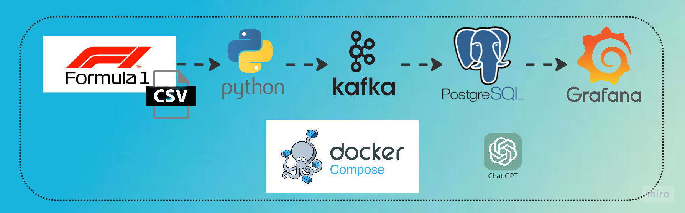
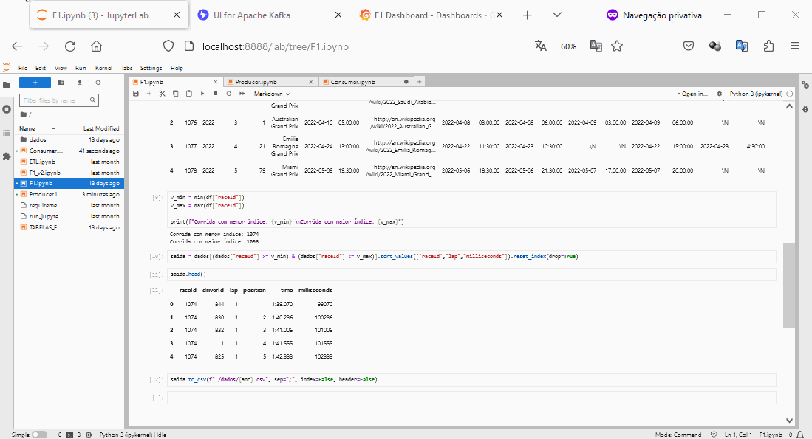
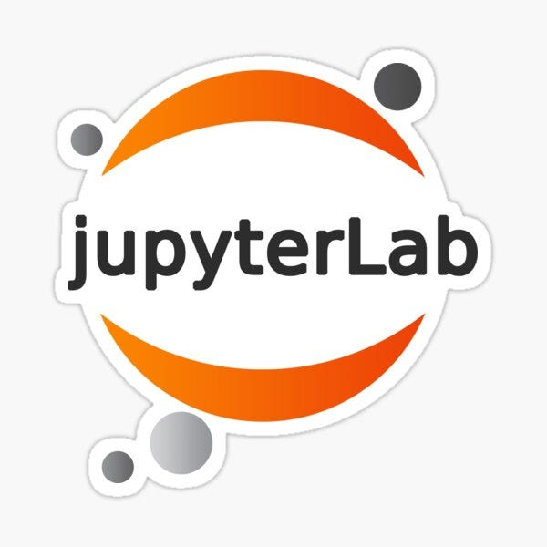
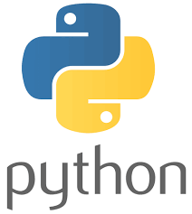
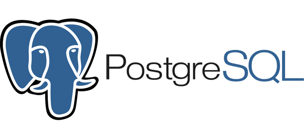

# O Projeto

Este projeto consiste em criar um ambiente completo de envio e coleta de dados via streaming. Fazer um tratamento nos dados e a visualização destes em um dashboard.
Queria que este projeto fosse de fácil replicação para que outras pessoas pudessem estudar o mesmo e evoluir conforme desejassem.



---

# Objetivos

Quando iniciei este projeto tinha alguns objetivos em mente:

- Criar um projeto completo utilizando o docker-compose
- Visualizar um processo de streaming com Kafka funcionando
- Utilizar o python como linguaguem para tratamento de dados
- visualizar o resultado em um dashboard

Ao longo do desenvolvimento do projeto, outros desafios foram aparecendo e quis testar o CHATGPT no apoio que este pode dar no desenvolvimento e resolução de projetos.

---

# Inspiração

Este projeto teve seu inicio graças ao e-mail que recebi da [kdnuggets](https://www.kdnuggets.com) com o [artigo](https://www.kdnuggets.com/building-a-formula-1-streaming-data-pipeline-with-kafka-and-risingwave) publicado pelo [Javier Granados](https://www.kdnuggets.com/author/javier-granados) na data de meu aniversário, com o projeto de coletar dados da F1 e fazer uso destes via streaming para visualizar em um dashboard no Grafana.
Achei a idéia super bacana e quiz reproduzir, fazendo algumas adaptações e incluindo algumas tecnologias.
Fica aqui meus sinceros agradecimento ao Javier pela inspiração.

---

# Por quê?

Desenvolvi esse projeto por curiosidade e diversão :)

Para mais projetos como esse visite o [canal](https://www.youtube.com/@andre_ricardo)...

---

# Mão na massa



## Pré-requisitos

1 - Tenha o Docker Compose instalado em seu computador <br>
2 - Navegador WEB, para visualizar e gerencias os seus comandos <br>
3 - Um Editor de Texto de sua preferência. Eu uso o Visual Studio! <br>
4 - Muita curiosidade e vontade de aprender! <br>

## Subindo o ambiente

1 - Faça o clone deste repositório em seu computador <br>
2 - Suba o ambiente no docker: ```docker compose -f "docker-compose.yml" up -d --build``` <br>

## Vendo a magia acontecer

1 - Abra o Jupyter Lab em seu navegador para ter acessos aos notebooks já criados: <http://localhost:8888> <br>
2 - Os dados coletados contém informações de diversos anos de corridas da F1, vamos utilizar apenas o ano de 2022. Para isto, execute o notebook [F1.ipynb](jupyter\F1.ipynb). Este deve gerar os dados de 2022 em um arquivo csv que vamos utilizar como fonte para o nosso processo de streaming. O Notebook [F1_v2](jupyter\F1_v2.ipynb) faz a mesma coisa que o anterior, mas gerando 1 arquivo para cada ano de corrida disponível. <br>
3 - Para monitorar o Kafka, temos o kafka-ui. Caso queira ver o processo de cadastro do cadastro e o Producer trabalhando acesse <http://localhost:8080> <br>
4 - Execute o notebook que simula o produtor de conteudo do Kafka(Producer): [Producer](jupyter\Producer.ipynb) <br>
8 - Em nosso projeto vamos guardar os dados no Postgres, para isto vamos usar o pgadmin para fazer a gestão do banco de dados. Acesso pelo link: <http://localhost:80> . Possivelmente irá solicitar o login e senha, utilize admin/admin <br>
9 - Configure a conexão ao banco do postgres. <br>
    hostname: postgres <br>
    port: 5432 <br>
    username: admin <br>
10 - Crie o banco de dados f1. <br>
11 - Crie o Schema f1_schema. <br>
12 - Execute o notebook [TABELAS_F1](jupyter\TABELAS_F1.ipynb) <br>
13 - Acesse o Grafana: <http://localhost:3000> . Provavelmente irá pedir login e senha: admin/admin <br>
14 - Faça o import do arquivo Json [F1](grafana\f1.json) no Grafana <br>
15 - Execute o notebook [Consumer](jupyter\Consumer.ipynb) <br>
16 - Abra o Grafana novamente e visualize os graficos e dados sendo atualizados <br>

---

# Observação

Os Dados utilizados neste projeto foram coletados do [kaggle](https://www.kaggle.com/datasets/rohanrao/formula-1-world-championship-1950-2020) <br>
Estes dados são o resultado da coleta via API do site <http://ergast.com/mrd/> <br>

---

# Possibilidades Futuras

Com base neste projeto, é possivel fazer um estudo analistico, pois a base é relativamente pequena, no postgres e estudar sobre BI. <br>
É possivel adaptar este projeto para visualizar o resultado em outras ferramentas graficas. <br>
Pode-se evoluir este projeto afim de coletar os dados em tempo real das corridas de F1. <br>
Adaptar este para acompanhar outros campeonatos. <br>

---

# CHATGPT

Uma curiosidade sobre o uso do ChatGPT neste projeto é que foi bastante útil para iniciar a criação do arquivo do docker compose, porém a solução apresentada para o Kafka não funcionou, sendo necessário pesquisar e rever as configurações. <br>
o ChatGPT é um ótimo aliado no nosso desenvolvimento de software e na resoluçao de problemas, mas ainda não podemos dizer que irá substituir alguém pois apresenta algumas falhas, mas adianta bastante o caminho de pesquisa e codificação. <br>

---

# Ferramentas Utilizadas

<p valign='center'>
<br>
Visual Studio <br>
<br>
<Br>
<br>
<br>
<br>

</p>
